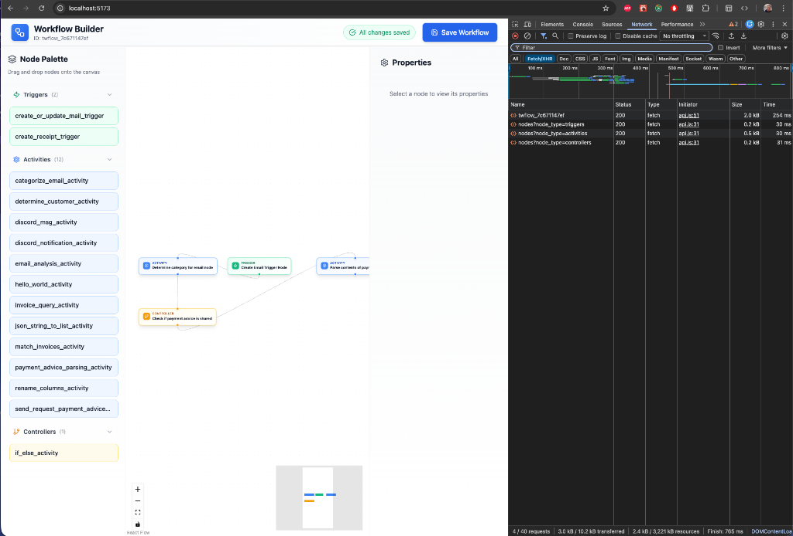
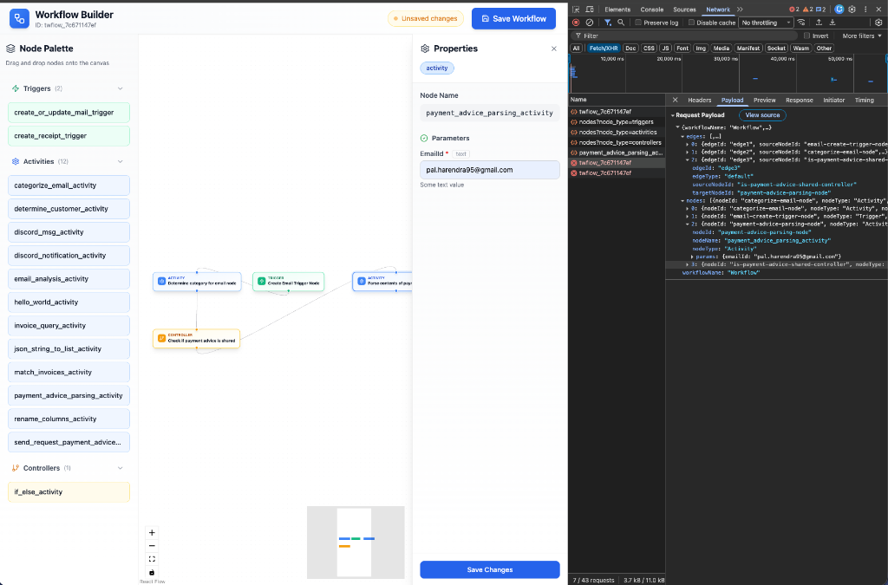

# Workflow Builder

A powerful, drag-and-drop workflow builder built with React, React Flow, and Redux.

## 🎥 Demo


## 📸 Screenshots

### Workflow Overview


### Payload Verification & Properties


## ✨ Features

- **Drag and Drop Interface**: Easily design workflows by dragging triggers, activities, and controllers from the palette.
- **Dynamic Property Panel**: 
  - Click any node to edit its properties.
  - Automatically generates forms based on API schemas.
  - Supports text, URL, dropdowns, and complex JSON configurations.
- **Robust State Management**:
  - Redux-based state for reliable undo/redo capabilities (extensible).
  - Validates connections and prevents invalid node links.
  - Tracks "Unsaved Changes" to prevent data loss.
- **Persistent Storage**:
  - Loads and saves workflows via REST API.
  - Handles complex data structures and nested parameters.
- **Interactive UI**:
  - Zoom and Pan canvas.
  - Mini-map for easy navigation.
  - Real-time validation warnings.

## 🛠️ Tech Stack

- **Frontend**: React, Vite
- **Flow Engine**: React Flow
- **State Management**: Redux Toolkit
- **Data Fetching**: React Query
- **Styling**: Tailwind CSS
- **Icons**: Lucide React

## 🚀 Getting Started

1.  **Install dependencies**:
    ```bash
    npm install
    ```

2.  **Start the development server**:
    ```bash
    npm run dev
    ```

3.  **Build for production**:
    ```bash
    npm run build
    ```

## 🧩 Project Structure

- `src/components/`: Core UI components (WorkflowCanvas, NodePalette, PropertiesPanel).
- `src/store/`: Redux slices and store configuration.
- `src/services/`: API integration and services.
- `src/utils/`: Helper functions for data transformation and ID generation.
- `src/hooks/`: Custom React hooks (mostly React Query wrappers).

## 💡 Key Functionalities

### Node Configuration
Select a node to open the **Properties Panel**. This panel dynamically renders inputs based on the node's type and schema. Complex parameters (like logic conditions) can be edited via a built-in JSON editor.

### Safety Features
- **Unsaved Changes Protection**: The "Save Workflow" button is disabled if you have unsaved edits in the Properties Panel, forcing you to commit changes locally first.
- **Validation**: Prevents invalid connections (e.g., inputs to Triggers).

## 📝 API Integration

The builder integrates with the **Rubik API** to:
- Fetch available node types (`/nodes`).
- Fetch node details and schemas (`/nodeDetails/:id`).
- Load and save full workflow definitions (`/workflows/:id`, `/workflow/update/:id`).

Included robust data transformation to handle `camelCase` (frontend) <-> `snake_case` (backend) conversion seamlessly.
